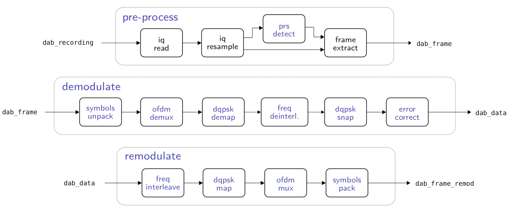
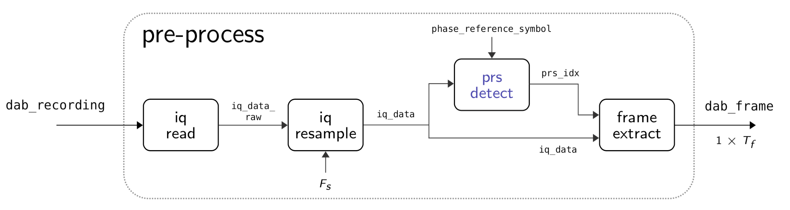
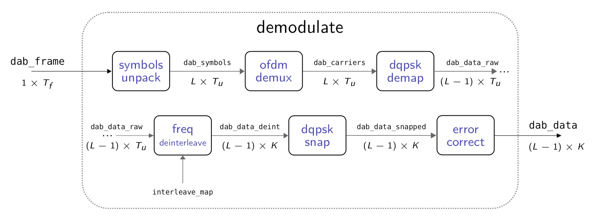
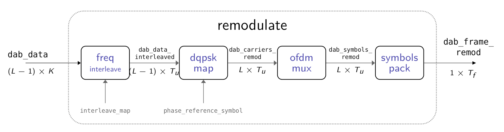

## Digital Audio Broadcasting Processing Chain for Passive Radar Applications

This repository contains the MATLAB code that was written for an undergraduate final-year project (EEE4022S) at the University of Cape Town. The aim of the project was to design a Digital Audio Broadcasting (DAB) processing chain for the context of Passive Radar.

A description of the various scripts and functions contained within this directory is given below.

---
### `./ref_builder.m`
This script emulates the functionality of a RefBuilder application, using the designed DAB chain. It receives a DAB recording and produces a perfectly reconstructed version thereof, along with the extracted DAB symbols.

---

### `./functions`
This folder contains the core functionality of the designed DAB processing chain. An overview of the chain is shown below:

Each of the three main blocks are described below.

#### `./functions/1_preprocess`
The `preprocess` functionality was designed to read in a DAB recording from a binary file, and output a single DAB frame from the recording. The sub-blocks for this function are shown below:

#### `./functions/2_demodulate`
The `demodulate` functionality was designed to demodulate a DAB frame, to a set of snapped, deinterleaved DQPSK values. The sub-blocks for this function are shown below:

#### `./functions/3_remodulate`
The `remodulate` functionality was designed to remodulate a DAB frame, to a perfectly reconstructed DAB frame. The sub-blocks for this function are shown below:

#### `./functions/4_misc`
This folder contains the utility/helper functions used in the processing chain.

---

### > `./demos`
This folder contains a variety of scripts used for creating the plots used in the final report.

---

### > `./tests`
This folder contains the scripts used in the *Validation* section of the report.

